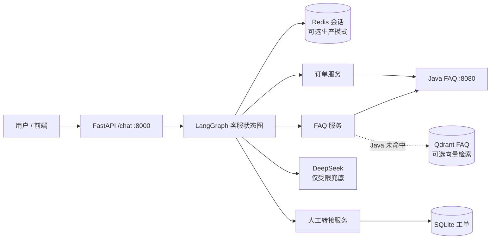

# 商城 Agent 智能客服：当前项目架构

## 目标与边界

Python Agent 以 Java 商城为受控业务数据源，处理 FAQ、订单与物流、售后、多轮会话和人工转接。
商品搜索、商品详情和购物车操作由商城 UI 负责，不在正式 `/chat` 链路内。Python 不直连 MySQL，模型也不能自行拼接 Java URL 或 SQL。

订单类请求优先使用 `Authorization: Bearer <商城 JWT>` 向 Java 解析用户身份；生产环境不接受客户端直接声明 `userId`。

## 运行关系



| 服务 | 默认地址 / 存储 | 用途 |
|---|---|---|
| Python Agent | `http://127.0.0.1:8000` | 聊天、健康检查、内部工单接口 |
| Java 商城 | `http://127.0.0.1:8080` | FAQ、订单和物流的受控数据源 |
| Redis | `redis://127.0.0.1:6379/0` | 生产会话、售后待办状态、TTL |
| Qdrant | `http://127.0.0.1:6333` | 可选 FAQ 向量检索与重排序 |
| SQLite | `data/customer_service.db` | 本地人工客服工单 |

## `/chat` 状态图

`app/agent/faq_agent.py` 使用 LangGraph `StateGraph` 编排。各节点只处理一个业务动作，路由顺序如下：

```text
读取会话状态与规则意图
  ├─ 售后待补订单号 → 核验订单
  ├─ 售后待补描述 → 收集诉求并提示人工
  ├─ 转人工 → 创建工单
  ├─ 明确订单 / 物流问题 → 查询 Java 订单接口
  └─ FAQ 检索
       ├─ Java FAQ 命中 → 返回标准答案
       ├─ Java 未命中且启用 Qdrant → 向量检索与重排序
       └─ 仍未命中 → LLM 受限意图识别
            ├─ 售后 → 进入售后流程
            ├─ 订单 → 查询 Java 订单接口
            └─ 其他 → DeepSeek 受限兜底回复
```

除转人工节点（需先写入本轮用户消息再创建工单）外，所有成功路径都会统一写入会话历史。

## 会话存储

`app/service/session_service.py` 统一提供会话历史和 `pending_action` 存取接口：

- `SESSION_BACKEND=redis`：Redis Hash 保存状态；每次读写续期；默认 TTL 30 分钟；历史保留最近 10 条；历史追加使用 Lua 原子脚本，适用于多进程和多节点。
- `SESSION_BACKEND=memory`：本地兼容模式，默认启用；进程重启或多实例时不保留状态。

Redis 连接检查：`GET /health/session`。

## 限流与审计

- `RATE_LIMIT_BACKEND=memory`：本地单进程滑动窗口。
- `RATE_LIMIT_BACKEND=redis`：Redis ZSET + Lua 原子脚本，多 Agent 实例共享限流状态；Redis 不可用时返回 HTTP 503，不会绕过保护。
- 聊天审计记录只保存路由来源、耗时、状态码和错误码，不保存问题、回答、订单号或手机号正文。
- Java 查询会对网络错误、429 和 5xx 指数退避重试；连续瞬时失败达到阈值时触发本地熔断，短暂返回 HTTP 503 与 `Retry-After`。

## FAQ 向量检索

`app/service/faq_vector_service.py` 在 Java FAQ 未命中时调用 Qdrant。同步脚本从 Java FAQ 分页读取启用项，调用配置的 OpenAI 兼容 Embeddings API 后写入向量库。查询时先做客服口语别名归一化，再以向量分数与文本相似度重排序；低于阈值的候选不回答。

## 目录与职责

```text
app/
├── agent/faq_agent.py            # LangGraph 客服状态图
├── config.py                     # .env 配置
├── java_client.py                # Java HTTP 接口封装
├── router/faq.py                 # /chat、FAQ 路由和依赖装配
├── router/staff.py               # 内部工单管理接口
├── router/system.py              # 健康检查
├── service/faq_service.py        # FAQ 调用
├── service/faq_vector_service.py # Qdrant FAQ 检索与同步
├── service/order_service.py      # 订单、物流摘要
├── service/rate_limit_service.py # 内存 / Redis 分布式限流
├── service/session_service.py    # Redis / 内存会话实现
├── service/handoff_service.py    # SQLite 工单
└── llm/                          # DeepSeek 回复与结构化意图分类
tests/
├── test_faq_agent.py             # 状态图主分支回归
├── test_faq_vector_service.py    # FAQ 归一化、回退与重排序
└── test_session_service.py       # 会话存储回归
```

调用方向固定为：`Router → Agent → Service → JavaClient → Java`。Router 只处理 HTTP；Agent 决策和编排；Service 不依赖路由。

## 接口

| 方法 | 路径 | 说明 |
|---|---|---|
| GET | `/health` | Agent 存活与当前会话后端 |
| GET | `/health/session` | 会话后端连接检查 |
| GET | `/health/java` | Java FAQ 连通性检查 |
| GET | `/faq/search` | Java FAQ 分页查询 |
| POST | `/chat` | 正式客服入口 |
| GET/PATCH | `/internal/tickets...` | 内部客服工单管理，需 `X-Staff-Key` |
| GET | `/internal/audit-events` | 聊天审计事件，需 `X-Staff-Key` |
| GET | `/internal/audit-events/summary` | 运维摘要聚合，需 `X-Staff-Key` |

## 验证与后续

当前单元测试覆盖 FAQ 优先、规则订单、售后多轮、人工转接、会话历史、限流、审计、Java 重试与 FAQ 向量回退：

```bash
DEEPSEEK_API_KEY=test uv run python -m unittest discover -s tests -v
```

另有 200 条口语化路由评测集。待 Java 与 Agent 启动后执行：

```bash
uv run python eval/run.py --user-id 1 --order-id 2087106115733889025
```

下一阶段需要配置可用的 Embeddings API，执行 FAQ 向量同步并评测语义命中率；随后补齐有效 JWT 登录态的端到端用例、限流与审计监控指标，以及 CRM 人工客服系统对接。
