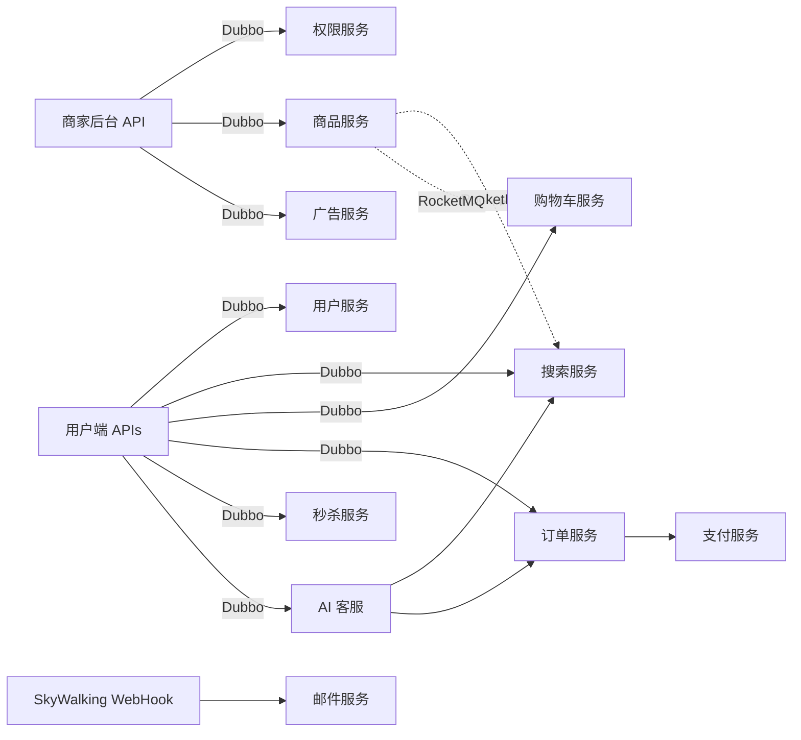

# Java 商城项目阅读指南

## 推荐入口

- [本地代码地图](code-atlas/site/index.html)
- [可视化工具说明](code-atlas/README.md)
- [3D 地图数据](code-atlas/generated/shopping.cc.json.gz)

第一次使用时，直接双击根目录下的 `打开代码地图.command`。地图内可以按系统关系、业务路线、REST 接口、复杂度热点和教程章节进入源码。

## 整体结构

## 建议阅读顺序

1. 先看 `shopping_common` 中的实体和服务接口，理解系统词汇。
2. 再选一条业务路线：商品管理、购买、秒杀、AI 客服或监控告警。
3. 从 `*_api/controller` 进入，沿 `@DubboReference` 找到对应 `*_service` 实现。
4. 最后深入 Mapper、Redis、RocketMQ 或 Elasticsearch。

## 当前源码中特别值得注意

- `shopping_search_service` 的 `SyncGoodsListener` 和 `DelGoodsListener` 上，RocketMQ 监听注解当前被注释；代码地图用红色虚线标出这类关系。
- 服务运行参数主要来自 Nacos，仓库中的 `bootstrap.yml` 只保存配置中心地址和前缀，因此端口、数据源等运行配置不完整。
- 原压缩包中的 `target` 和 SkyWalking Agent 没有解入源码目录；原始 `shopping.rar` 仍完整保留。
