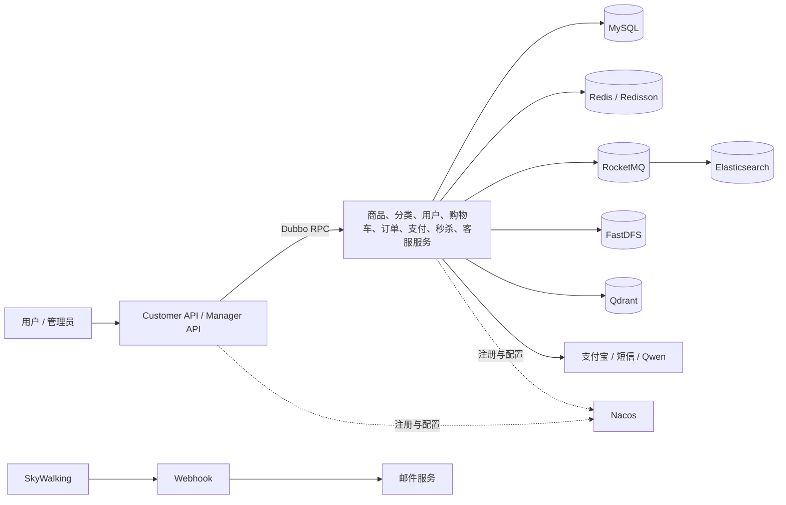
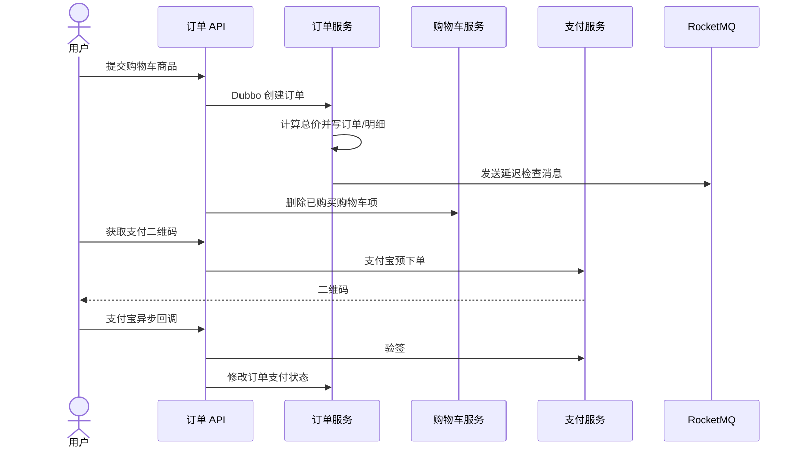

# Shopping 微服务项目面试手册

> 适用范围：当前 `shopping` 练习项目源码。  
> 使用原则：面试时只陈述代码中真实存在的能力；对未完成或带演示性质的功能，先说明现状，再给出改造方案。

## 1. 项目事实卡

| 项目项 | 当前代码情况 |
| --- | --- |
| 项目类型 | Java 电商微服务练习项目 |
| Java 版本 | Java 17 |
| 核心框架 | Spring Boot 3.3.4、Spring Cloud 2023.0.3、Spring Cloud Alibaba 2023.0.1.0 |
| 服务治理 | Apache Dubbo 3.3.0、Nacos 注册中心与配置中心 |
| 数据访问 | MyBatis-Plus、MySQL |
| 缓存与锁 | Redis、Redisson、布隆过滤器 |
| 消息队列 | RocketMQ |
| 搜索 | Elasticsearch |
| 安全 | Spring Security、JWT、BCrypt、MD5（用户端旧实现） |
| 分布式能力 | Sentinel、Seata 依赖/注解基础、SkyWalking 告警回调 |
| 其他能力 | FastDFS、支付宝当面付、Spring AI Alibaba、Qdrant、邮件告警 |
| 工程规模 | 23 个 Maven 模块、约 169 个主 Java 文件、约 101 个 REST 接口、约 22 条 Dubbo 调用关系 |

### 模块分组

| 分组 | 主要模块 | 职责 |
| --- | --- | --- |
| 公共能力 | `shopping_common` | 统一返回、异常、工具类、通用实体 |
| 商品后台 | `shopping_goods_service`、`shopping_category_service`、`shopping_file_service`、`shopping_admin_service`、`shopping_manager_api` | 商品、分类、文件、后台账号和权限 |
| C 端交易 | `shopping_user_service`、`shopping_user_customer_api`、`shopping_cart_service`、`shopping_cart_customer_api`、`shopping_order_service`、`shopping_order_customer_api` | 用户、购物车、订单、支付入口 |
| 搜索与消息 | `shopping_search_service`、`shopping_search_customer_api`、`shopping_message_service` | Elasticsearch 搜索、短信等消息能力 |
| 秒杀 | `shopping_seckill_service`、`shopping_seckill_customer_api` | 秒杀商品、Redis 库存、分布式锁、超时恢复 |
| 支付 | `shopping_pay_service` | 支付宝预下单、验签和支付记录 |
| 智能客服 | `shopping_custcare_service`、`shopping_custcare_customer_api` | FAQ 向量检索、模型对话、商品和订单函数调用 |
| 可观测性 | `shopping_webhooks`、`shopping_mail_service` | SkyWalking 告警接收和邮件通知 |

## 2. 面试开场话术

### 30 秒版本

这是一个基于 Java 17 和 Spring Boot 3 的电商微服务练习项目，共拆分为 23 个 Maven 模块。项目通过 Dubbo 完成服务间 RPC，使用 Nacos 做注册和配置管理，MySQL 与 MyBatis-Plus 保存业务数据，Redis 支撑购物车、验证码和秒杀库存，RocketMQ 解耦商品、购物车和订单流程，Elasticsearch 实现商品检索。项目还实现了 Spring Security 权限控制、JWT 用户认证、支付宝支付、FastDFS 文件上传，以及基于 Qwen 和 Qdrant 的智能客服。

### 2 分钟版本

这个项目覆盖了一个电商系统从后台商品管理到用户下单支付的主要链路。后台可以维护分类、品牌、商品、规格、管理员角色和权限；用户端包含注册登录、商品搜索、购物车、订单、支付和秒杀；此外还有 FAQ 向量检索与大模型客服，以及 SkyWalking 告警转邮件的运维链路。

架构上，我按业务边界拆分服务，HTTP API 层负责接入，服务之间通过 Dubbo 调用，Nacos统一管理服务发现和外部配置。商品更新后通过 RocketMQ通知搜索索引与购物车快照，搜索服务用 Elasticsearch 完成分词、组合条件、补全和聚合。秒杀服务把热点库存放在 Redis 中，通过 Redisson 锁保护扣减，通过过期事件尝试恢复未支付库存。

这个练习项目也保留了一些值得改造的问题，例如支付回调没有形成真正的分布式事务、部分 MQ 消费者被注释、秒杀的过期时间不一致、用户端密码仍使用 MD5、JWT 密钥写在源码中。我会把这些问题作为项目复盘重点：先保证安全和资金链路正确，再补幂等、最终一致性、可观测性和自动化测试。

## 3. 总体架构

### 一次普通购买的核心链路

> 注意：上图表示设计链路。当前代码中的订单延迟消费者已被注释，支付回调还包含故意制造异常的演示代码，因此不能说该链路已经达到生产可用状态。

## 4. 高频项目问答

### A. 项目与架构

#### 1. 你在项目中主要做了什么？

我完成并梳理了商品、分类、用户、购物车、订单、支付、秒杀、搜索和智能客服等业务模块。技术重点是 Dubbo 服务调用、Redis 热点数据、RocketMQ 异步解耦、Elasticsearch 商品搜索、Spring Security/JWT 认证，以及秒杀并发控制。复盘阶段我还定位了支付幂等、跨服务一致性、密钥管理和秒杀过期时间等问题，并给出了分阶段改造方案。

#### 2. 为什么要拆成微服务？

电商的商品、交易、用户、搜索和秒杀在业务边界、流量特征和资源需求上不同。拆分后可以独立部署和扩容，例如搜索主要消耗 Elasticsearch，秒杀主要依赖 Redis 和锁，订单侧更重视数据正确性。但微服务也引入了调用失败、数据一致性、运维和链路追踪成本，因此小规模系统不应为了技术而拆分。

#### 3. 服务是按什么原则拆分的？

主要按领域职责和数据所有权拆分：商品服务管理商品主数据，订单服务管理订单与明细，支付服务封装支付宝能力，搜索服务只维护可重建的检索索引。API 模块作为接入层，不直接承担核心数据持久化。当前项目还可以继续收敛重复的 `customer_api` 模块，避免接入层过多。

#### 4. 为什么同时有 API 模块和 Service 模块？

API 模块负责 HTTP 协议、参数接收和用户上下文，Service 模块负责业务规则和数据访问，二者通过 Dubbo 解耦。好处是核心能力可被后台、用户端或其他服务复用；代价是一个简单操作可能跨越多个进程，需要处理超时、重试和幂等。

#### 5. 项目采用了哪些通信方式？

同步调用主要使用 Dubbo，适合需要立即返回结果的查询和命令；异步通知使用 RocketMQ，适合商品同步到搜索、商品变化刷新购物车、订单延迟检查等场景；对用户或管理员提供 REST 接口；Redis 过期事件用于秒杀未支付订单的库存恢复。

#### 6. 为什么选 Dubbo 而不是只用 OpenFeign？

这个项目的服务接口以 Java 为主，Dubbo 能直接以接口契约提供高性能 RPC、注册发现、超时和负载均衡能力。Feign 更贴近 HTTP 生态、跨语言更自然。真实选型要考虑团队和异构需求，本项目使用 Dubbo 是为了练习 RPC 服务治理，不代表所有场景都优于 HTTP。

#### 7. Nacos 在项目中做什么？

一是注册中心，让 Dubbo 服务提供者和消费者发现彼此；二是配置中心，模块的 `bootstrap.yml` 只保存 Nacos 地址和配置前缀，数据库、端口及第三方参数从 Nacos加载。这样能避免把环境配置散落在各个 Jar 中，但敏感配置还应结合密钥系统管理。

#### 8. 项目最大的亮点是什么？

我会选择两点回答。第一，业务链路覆盖较完整，能把 RPC、缓存、消息、搜索和支付串起来，而不是孤立使用中间件。第二，智能客服不是单纯聊天，而是先用 Qdrant 匹配 FAQ，再通过模型函数调用查询真实商品和订单数据。不过目前仍需要补强授权边界和持久化记忆。

### B. Dubbo、Nacos 与分布式系统

#### 9. Dubbo 调用失败如何处理？

先设置合理的连接、读取超时和有限重试；查询类请求可以重试，非幂等写操作不能盲目重试。调用方应区分超时、业务异常和系统异常，并通过降级或补偿保证核心流程可控。订单、支付等写操作还要配业务唯一键，确保重复调用不会产生重复数据。

#### 10. RPC 接口怎么演进？

新增字段尽量保持向后兼容，不随意改变现有字段语义；重大变化可引入版本号或新接口；提供者先兼容旧消费者，再逐步升级消费者。DTO 不应直接暴露数据库实体，避免表结构变化传播到所有服务。

#### 11. 分布式事务在当前项目中做到了吗？

没有完整做到。项目引入了 Seata 相关依赖，支付控制器也导入了 `@GlobalTransactional`，但当前关键链路没有真正使用全局事务。订单创建后删除购物车，以及支付回调中修改订单和新增支付记录，都可能发生部分成功。面试中应明确说明这是待改造项。

#### 12. 如何改造跨服务一致性？

订单与购物车可以采用本地事务加事务消息或 Outbox：订单本地提交时同时写事件表，后台可靠投递“清理购物车”事件，消费者幂等执行。支付链路以支付宝交易号和订单号建立唯一约束，验签与金额校验通过后更新订单，并记录支付流水；失败事件进入重试和人工对账。强一致场景才考虑 Seata，不能把全局事务当成默认答案。

#### 13. 如何防止服务雪崩？

在入口做限流，在 RPC 设置超时和并发隔离，对非核心依赖做熔断降级，重试必须有上限和退避，并通过缓存承接热点读取。项目已使用 Sentinel 注解展示限流和降级，但要投入生产还需要统一规则、监控告警和压测验证。

#### 14. 注册中心不可用会怎样？

已经获取到的服务地址通常可在本地缓存中继续使用，因此短时间故障不一定中断所有调用；但新实例无法正常注册或发现，配置变更也会受影响。应部署 Nacos 集群、做好持久化与监控，并避免业务请求实时强依赖注册中心查询。

#### 15. 你如何排查一个跨服务慢请求？

先从网关或 API 的 traceId 定位完整链路，比较各 RPC、数据库、Redis 和外部接口耗时；再结合服务 CPU、GC、线程池、连接池和慢 SQL 指标判断瓶颈。项目存在 SkyWalking 告警接收模块，但代码中只覆盖告警转邮件，完整链路追踪和指标看板仍需部署环境配合。

### C. Redis、缓存与消息队列

#### 16. Redis 在项目中有哪些用途？

包括短信验证码、购物车、分类缓存、秒杀商品与库存、临时秒杀订单、布隆过滤器和 Redisson 分布式锁。不同场景的数据模型和一致性要求不同，不能笼统地把 Redis 只称为“缓存”。

#### 17. 购物车为什么放 Redis？

购物车读写频繁、允许一定程度的最终一致，放 Redis 能减少数据库压力。当前实现使用一个名为 `cartList` 的 Hash，以用户 ID 为 field、完整购物车列表为 value。实现简单，但修改一个商品也需要读写整个列表，且商品变化时会扫描所有用户购物车，不适合大规模数据。

#### 18. 购物车 Redis 结构怎么优化？

可以为每个用户使用独立 Hash，例如 `cart:{userId}`，field 为 SKU ID，value 为数量和必要快照；再建立 `sku -> userId` 的反向集合，定向更新受影响购物车。还应设置合理过期时间，数量变更使用 Lua 保证原子性，并避免全库扫描。

#### 19. 分类缓存采用什么策略？

读取时先查 Redis，未命中则查 MySQL 并回填；增删改后主动重新加载缓存，属于 Cache-Aside 的变体。当前实现没有防止缓存击穿和重建并发，也没有清晰的 TTL 策略。可增加互斥重建、逻辑过期或双删策略，并确认列表写入顺序。

#### 20. 如何解决缓存穿透、击穿和雪崩？

穿透可用参数校验、空值缓存和布隆过滤器；击穿可用互斥锁、逻辑过期和热点预热；雪崩可让 TTL 随机化、分批预热、限流降级并保证 Redis 高可用。项目秒杀使用了布隆过滤器，但布隆判定不存在后当前只打印日志，没有提前返回，因此尚未真正阻断穿透。

#### 21. 商品为什么通过 MQ 同步搜索和购物车？

商品数据库是主数据，搜索索引和购物车商品快照是派生数据，不应把它们放在一个同步长事务里。MQ 可以降低商品写操作延迟，并让下游独立重试。代价是短时间数据不一致，因此消费者必须幂等，还要有重试、死信和补偿重建机制。

#### 22. 如何保证 MQ 消息不丢？

生产端不能只在数据库提交后直接发送一次。更稳妥的是本地事务同时写业务表和 Outbox 事件表，再由可靠任务投递；Broker 使用可靠刷盘与副本；消费成功后再确认。还要监控积压、重试和死信，并提供按商品或时间范围重建 Elasticsearch 索引的后台任务。

#### 23. 如何处理重复消息？

MQ 通常只能保证至少一次投递，消费者必须幂等。可用业务唯一键、数据库唯一索引、消费记录表或 Redis `SETNX` 去重。商品同步天然可以按商品 ID 覆盖写，支付和库存操作则必须有更严格的状态机和唯一约束。

#### 24. 当前 MQ 链路真的都能运行吗？

不能。购物车同步和删除监听器是启用的，但搜索服务中的商品新增/更新与删除监听器代码被整体注释；订单超时检查监听器也被注释。因此生产消息的代码存在，不代表端到端闭环已经完成。

### D. Elasticsearch 搜索

#### 25. 商品搜索实现了哪些功能？

实现了关键词多字段匹配、品牌精确过滤、价格区间、规格条件、分页和排序，也使用 completion suggestion 做自动补全。结果页还基于命中商品构造品牌和规格筛选面板。

#### 26. MySQL 和 Elasticsearch 如何分工？

MySQL 保存商品权威数据，负责事务和精确查询；Elasticsearch 保存可重建的搜索文档，负责全文检索、条件组合和排序。商品变更先落 MySQL，再异步更新 ES。ES 故障不应影响商品主数据写入，但会让搜索结果短暂过期。

#### 27. Elasticsearch 数据不一致怎么办？

首先让 MQ 消费幂等并可重试；其次记录同步失败，进入死信或补偿队列；最后提供全量和按 ID 重建索引工具。上线新 mapping 时采用新索引加别名原子切换，避免直接破坏线上索引。

#### 28. 当前搜索聚合有什么问题？

筛选面板是从前 20 条命中结果中在应用侧拼装的，不能代表完整结果集。更合理的是使用 Elasticsearch terms、range 等 aggregation，让聚合在所有命中文档上执行，并为高基数字段控制桶数量和性能。

#### 29. 如何优化深分页？

普通 `from + size` 越深成本越高。后台导出可使用 scroll 或 PIT，用户连续翻页可用 `search_after` 配合稳定排序键。常规商品列表还应限制最大页码，避免任意深分页拖垮集群。

### E. 用户认证与后台权限

#### 30. 用户端和后台端如何认证？

用户端通过手机号验证码或账号密码登录，成功后签发 RSA SHA-256 的 JWT；后台端使用 Spring Security 表单登录和 Session，管理员密码使用 BCrypt。二者面向的客户端和安全边界不同，所以采用了不同方案。

#### 31. JWT 的优缺点是什么？

优点是服务端可以少保存会话状态，适合多服务认证；缺点是签发后不易立即撤销，令牌泄露会在有效期内持续生效。可采用短期 Access Token、Refresh Token、密钥轮换和必要的黑名单机制，并始终通过 HTTPS 传输。

#### 32. 当前 JWT 实现有什么安全问题？

RSA 私钥和公钥直接写在源码中，这是高风险问题；令牌有效期为 24 小时，失效控制也较弱；验证失败时返回空 Map，容易让调用方忽略认证失败。应把密钥放入环境密钥服务，支持 `kid` 与轮换，并以明确异常中断未认证请求。

#### 33. 项目密码存储安全吗？

后台管理员使用 BCrypt，相对合理；用户端仍使用自定义 MD5，不适合生产。MD5 速度太快，抗暴力破解能力弱，应迁移到 BCrypt、Argon2 或 PBKDF2，并为旧密码设计登录时渐进升级方案。

#### 34. RBAC 是怎样实现的？

管理员与角色、角色与权限都是多对多关系。登录时通过 Dubbo 查询管理员，再加载其权限 URL，转换为 Spring Security 的 `GrantedAuthority`。这形成了用户—角色—权限模型。

#### 35. 后台权限控制是否完整？

不完整。安全配置保证除登录外的请求需要认证，但代码中只有少量接口使用 `@PreAuthorize` 做细粒度授权，例如管理员和角色搜索。大量 CRUD 接口只是“登录即可访问”，需要统一给控制器或服务方法补权限注解，并测试越权场景。

#### 36. 为什么关闭 CSRF 有风险？

后台使用 Cookie/Session 表单登录时，浏览器会自动携带 Cookie，因此关闭 CSRF 可能让攻击者诱导管理员提交跨站请求。若保留 Session，应开启 CSRF Token；若彻底改成不依赖 Cookie 的 Bearer Token，也要同时处理 XSS、CORS 和 Token 存储风险。

### F. 订单与支付

#### 37. 创建订单时做了什么？

订单服务按商品单价和数量使用 `BigDecimal` 计算总金额，保存订单主表和订单明细，初始状态设为待支付，然后向 RocketMQ 发送一条延迟检查消息。接入层收到订单后逐个删除已购买的购物车项。

#### 38. 为什么金额必须使用 BigDecimal？

`float` 和 `double` 是二进制浮点数，十进制金额可能产生精度误差。金额计算应使用 `BigDecimal`，明确舍入规则，并统一以分为整数或固定精度小数保存。创建订单时还应使用服务端商品价格快照，不能相信客户端金额。

#### 39. 订单状态机应怎么设计？

至少包括待支付、已支付、已取消、已发货、已完成和退款相关状态。状态转换必须有前置条件，例如只有待支付才能支付或取消；更新 SQL 应带当前状态条件，实现 CAS 式更新，避免支付回调与超时关单并发覆盖。

#### 40. 延迟关单当前有什么问题？

发送代码使用 RocketMQ 延迟级别 4，代码旁的级别说明对应约 30 秒，但业务注释写的是 30 分钟；同时检查订单的消费者被注释，因此实际不会自动关单。应统一业务超时时间，启用消费者，并在消费时再次查询订单状态后幂等关闭。

#### 41. 支付回调应该校验什么？

必须验证支付宝签名、应用 ID、商户订单号、交易状态、支付金额和收款方身份；还要检查订单存在且处于可支付状态。以支付宝交易号建立唯一约束，重复回调直接返回成功，不能重复记账。

#### 42. 当前支付回调有哪些问题？

验签后会先远程修改订单状态，随后代码故意执行 `1 / 0` 制造异常，再尝试保存支付记录。这是分布式事务演示代码，不是可上线实现。本地 `@Transactional` 不能回滚远程 Dubbo 服务；此外还缺少完整金额校验和严格幂等，交易号字段也应使用支付宝真实交易号。

#### 43. 支付成功但订单状态没更新怎么办？

回调处理要可重试且幂等；主动查询支付结果作为兜底；定时对账比对支付平台流水、支付记录和订单状态；异常进入告警和人工处理队列。资金相关系统不能只依赖一次异步通知。

#### 44. 订单创建成功但购物车删除失败怎么办？

购物车不是订单正确性的权威数据，订单创建成功应优先返回。通过可靠事件异步清理购物车，消费者按用户 ID 和 SKU ID 幂等删除；即使暂时失败，也不应回滚已创建订单。前端也可根据订单结果临时隐藏已购买项。

### G. 秒杀与高并发

#### 45. 秒杀流程是怎样的？

定时任务把活动商品和库存预热到 Redis，并加入布隆过滤器；用户下单时按商品 ID 获取 Redisson 锁，检查 Redis 库存，生成雪花 ID 的临时订单，扣减库存并写入 Redis；临时订单过期后，监听器尝试恢复库存；支付成功再转入正式交易流程。

#### 46. 为什么秒杀库存放 Redis？

秒杀流量短时间高度集中，直接更新 MySQL 会受到行锁、连接池和磁盘写入限制。Redis 单线程执行命令且内存读写快，适合承接热点库存。但库存最终仍要落数据库，并处理 Redis 故障、重复请求、超卖和少卖。

#### 47. 当前秒杀库存扣减会不会超卖？

同一商品通过分布式锁串行化，能降低并发覆盖，但当前代码只判断库存是否小于等于 0，然后直接减去购买数量，没有判断 `stockCount < num`，购买多件时仍可能减成负数。更推荐用 Lua 脚本原子完成校验、扣减和一人一单判断，减少锁开销。

#### 48. Redisson 锁实现有什么风险？

当前 `tryLock(expireTime, TimeUnit.MILLISECONDS)` 使用的是等待时间重载，并没有显式指定租约时间；注释与实际语义容易不一致。释放锁时只判断 `isLocked`，应判断 `isHeldByCurrentThread`，否则可能误解锁或抛异常。还要避免业务执行超过租期、锁粒度过粗和异常路径未释放。

#### 49. 秒杀订单过期恢复库存可靠吗？

目前不够可靠。订单业务字段写的是 5 分钟到期，但 Redis TTL 使用了约 100 分钟和 102 分钟，注释又写 1 分钟，三者不一致；过期监听还依赖 `_copy` 备份键，缺少充分的空值与重复处理保护。应统一超时常量，并用状态机和幂等补偿保证只恢复一次。

#### 50. Redis Key 过期通知适合做唯一关单机制吗？

不适合。过期事件可能延迟，订阅方宕机期间也可能错过消息。它可作为辅助机制，但更稳妥的是延迟队列加定时扫描兜底，处理时再检查订单状态，并通过唯一事件或状态条件实现幂等。

#### 51. 如何防止同一用户重复秒杀？

可在 Redis 用 `userId + activityId + skuId` 建唯一标记，并通过 Lua 将重复校验和库存扣减放在同一原子操作中；数据库正式订单再设置唯一索引作为最终防线。仅靠前端按钮置灰无法保证安全。

#### 52. 秒杀接口如何限流？

在网关按用户、IP 和活动限流，活动开始前返回静态页面，接口加入动态路径或短期令牌，核心服务再用 Sentinel 控制并发。请求进入后尽量只做 Redis 原子操作并快速返回排队结果，后续创建订单异步化。

### H. 智能客服、文件与可观测性

#### 53. 智能客服如何工作？

用户输入先经过敏感词检查，再用 Qdrant 做 FAQ 相似度检索；命中高相似答案时直接返回，未命中再交给 Qwen 模型。模型可调用商品搜索和订单查询函数，并使用最近 10 条消息作为对话记忆。

#### 54. 为什么使用 RAG，而不是全部交给大模型？

FAQ 和业务数据需要可更新、可追溯。向量检索能优先返回企业知识，降低幻觉和模型成本；模型负责理解表达和组织答案。订单、库存、价格等实时数据仍应通过受控函数查询，不能靠模型记忆生成。

#### 55. 当前智能客服有什么代码问题？

系统提示词保存在单例服务的实例字段中，并在每次请求时使用 `+=` 追加用户信息，会导致提示词不断增长和并发串扰；应改为不可变基础提示词加请求内局部变量。对话记忆仅在内存中，重启会丢失，也不适合多实例共享。

#### 56. 模型函数调用如何防止越权？

不能相信模型生成的 `userId`。后端必须从认证上下文取得当前用户，将其作为不可修改参数注入订单查询；模型只负责提供订单号等普通参数。工具接口还应限制字段、超时、调用次数并记录审计日志，防止提示注入扩大权限。

#### 57. FAQ 写入 MySQL 和 Qdrant 如何保证一致？

当前是先后写两个存储，不能通过一个本地事务原子提交。可以把 MySQL 作为权威数据，提交后写 Outbox 事件，异步更新 Qdrant；失败可重试，并提供按 FAQ ID 或全量重建向量索引的工具。

#### 58. 文件上传有什么安全要求？

不能只相信文件名后缀。应限制文件大小和 MIME 类型，读取文件头验证真实类型，随机生成存储名，隔离上传目录，并对公开内容做病毒或恶意脚本检测。当前 FastDFS 实现主要完成上传和 URL 拼接，这些校验还没有补齐。

#### 59. SkyWalking 告警链路如何工作？

SkyWalking 把告警 POST 到 Webhook 模块，Webhook 组装邮件内容后通过 Dubbo 调用邮件服务发送。当前收件地址写死在代码中，Webhook 也缺少签名或网络访问控制；应改为配置化联系人、鉴权、去重和告警聚合。

#### 60. 如何提升项目可观测性？

统一 traceId 并贯穿 HTTP、Dubbo 和 MQ；收集接口延迟、错误率、JVM、连接池、Redis、MQ 积压、ES 查询及业务指标；日志使用结构化格式并脱敏。关键告警要包含服务、环境、时间、错误摘要和排障链接，并避免同一故障产生邮件风暴。

## 5. 面试官可能追问的代码缺陷

回答公式：**先承认现状 → 说明风险 → 给出可实施修复 → 补充验证方法**。

| 代码现状 | 风险 | 推荐回答 |
| --- | --- | --- |
| JWT RSA 密钥写在源码 | 私钥泄漏后可伪造令牌 | 迁移到密钥管理系统，按环境注入，支持 `kid` 和轮换；旧密钥保留短期验签窗口 |
| 用户密码使用 MD5 | 易被高速暴力破解 | 新密码改 BCrypt/Argon2；旧用户登录成功后重新哈希并更新 |
| 支付回调中有 `1 / 0` | 订单已改状态但支付记录未落库 | 删除演示异常；用幂等状态机、可靠事件和对账替代对远程事务的幻想 |
| `@Transactional` 包含远程 Dubbo 调用 | 只能回滚本地数据库 | 使用 Seata 的适用模式，或更推荐本地事务 + Outbox + 补偿 |
| ES 消费者被注释 | 商品和索引不一致 | 恢复消费者，补幂等、重试、死信、监控和索引重建 |
| 延迟关单消费者被注释 | 未支付订单不会自动取消 | 恢复监听，统一超时配置，定时扫描兜底 |
| 延迟级别与“30 分钟”注释不符 | 可能过早关单 | 将业务超时抽为配置，并按 RocketMQ 版本选择正确延迟机制 |
| 秒杀 TTL 有 5/100/102 分钟等多种口径 | 库存很晚才恢复或状态错乱 | 用一个常量统一订单失效、Redis TTL 和延迟消息时间 |
| 秒杀只检查库存 `<= 0` | 多件购买时可能扣成负数 | 原子判断 `stock >= num`，优先使用 Lua |
| 布隆过滤器 miss 后只打印 | 没有真正防穿透 | miss 直接返回不存在；仍需处理误判和数据更新 |
| 解锁只检查 `isLocked` | 非持有线程可能尝试解锁 | 使用 `isHeldByCurrentThread`，并在 `finally` 中释放 |
| 购物车商品变更扫描全部用户 | 数据量大时阻塞 Redis 和应用 | 按用户分 Key，建立 SKU 反向索引或采用懒更新快照 |
| AI 提示词使用实例字段累计 | 内存增长、用户信息串扰、并发不安全 | 使用不可变基础模板和方法内局部字符串 |
| AI 订单工具接收模型提供的 userId | 可能越权查询他人订单 | userId 必须从认证上下文注入，模型不可控制 |
| FAQ 双写 MySQL 与 Qdrant | 部分成功导致向量数据不一致 | MySQL + Outbox，异步同步 Qdrant，并提供重建 |
| 文件上传只看后缀 | 可上传伪装恶意文件 | 校验大小、MIME、魔数、内容并随机命名 |
| 告警邮箱硬编码、Webhook 无鉴权 | 信息泄露、接口被滥用 | 联系人配置化，增加签名、白名单、限流和去重 |

## 6. 不要在面试中说错

- 不要说“项目已经用 Seata 保证支付分布式事务”。当前关键方法没有启用全局事务。
- 不要说“订单 30 分钟后一定自动取消”。延迟级别不匹配，而且消费者被注释。
- 不要说“商品修改一定会同步 Elasticsearch”。消息会生产，但搜索消费者目前被注释。
- 不要说“布隆过滤器已经阻止缓存穿透”。当前 miss 分支没有提前返回。
- 不要说“所有密码都用 BCrypt”。后台管理员是 BCrypt，用户端是 MD5。
- 不要说“JWT 密钥安全存储”。当前密钥硬编码在源码中。
- 不要说“购物车使用分布式数据库持久化”。当前主要保存在 Redis Hash 中。
- 不要说“AI 对话记忆支持集群和持久化”。当前是内存记忆，只保存最近 10 条。
- 不要说“支付回调已经完整幂等并做金额校验”。当前实现仍是练习状态。
- 不要把代码缺陷藏起来。能准确发现并提出落地方案，通常比夸大完成度更有说服力。

## 7. 可用于 STAR 回答的项目故事

### 故事一：商品数据异步同步

**背景：** 商品更新同时影响 MySQL、Elasticsearch 和购物车快照，若全部同步调用，会增加后台操作耗时并扩大故障范围。  
**任务：** 解耦商品主数据与派生数据。  
**行动：** 商品服务先在本地事务中更新商品及关联数据，再发送不同主题的 RocketMQ 消息，让搜索和购物车独立消费；分析消费幂等、失败重试和重建索引方案。  
**结果：** 写链路边界更清晰，主数据与派生数据职责分离。复盘发现搜索消费者被注释，因此进一步提出 Outbox、死信监控和全量重建方案。

### 故事二：秒杀库存并发控制复盘

**背景：** 秒杀流量集中，直接访问 MySQL 容易形成热点行锁。  
**任务：** 使用 Redis 承接库存并减少超卖。  
**行动：** 预热商品和库存，使用布隆过滤器、Redisson 锁、雪花 ID 和 Redis 临时订单；随后审查出多件购买判断、锁释放方式和 TTL 不一致问题，并设计 Lua 原子扣减与延迟队列补偿。  
**结果：** 不只完成了中间件接入，也能解释方案边界和生产化所需改造。

### 故事三：智能客服接入真实业务

**背景：** 通用模型容易对商品和订单信息产生幻觉。  
**任务：** 让客服既能回答 FAQ，又能查询实时业务数据。  
**行动：** 先用 Qdrant 做 FAQ 相似检索，未命中再调用 Qwen；通过函数调用接入商品搜索和订单查询，并保存短期对话上下文。复盘时识别出提示词共享变量和模型参数越权风险。  
**结果：** 实现了“向量知识 + 模型生成 + 业务工具”的组合链路，并形成了后端强制注入用户身份的安全方案。

### 故事四：支付一致性问题定位

**背景：** 支付回调跨越订单服务和支付服务，本地事务无法覆盖远程调用。  
**任务：** 判断故意抛异常后数据为何出现部分成功。  
**行动：** 沿调用链确认 `@Transactional` 只控制当前进程数据库，远程订单状态已经提交；设计验签、金额校验、唯一交易号、幂等状态机、可靠事件和对账任务。  
**结果：** 把一个演示性异常转化为对分布式一致性和资金安全的完整分析。

## 8. 生产化改造路线

### P0：安全与正确性

1. 删除支付回调中的演示异常，补充验签字段、金额、商户身份和交易状态校验。
2. 给订单状态修改、支付流水和回调建立幂等约束，增加主动查询与对账。
3. 移除源码中的 RSA 私钥、固定邮箱和第三方敏感配置，接入环境密钥管理。
4. 用户密码从 MD5 迁移到 BCrypt 或 Argon2。
5. 恢复并修复 ES 同步和订单延迟消费者，统一订单超时配置。
6. 修复秒杀库存数量判断、锁释放和 TTL，恢复库存逻辑必须幂等。
7. AI 订单工具从认证上下文取得用户 ID，修复共享提示词。

### P1：可靠性与性能

1. 商品、订单、购物车和 FAQ 同步引入 Outbox/事务消息。
2. MQ 消费增加唯一键、重试、死信、积压告警和人工补偿入口。
3. 购物车改为用户级 Hash，避免扫描所有用户；分类缓存增加防击穿策略。
4. 秒杀使用 Lua 原子校验库存和一人一单，入口增加分层限流。
5. Elasticsearch 使用聚合构造筛选面板，提供索引别名和全量重建。
6. AI 记忆改为按会话隔离的 Redis 或持久化存储，增加工具调用审计。
7. Webhook 增加签名、IP 白名单、限流和告警去重。

### P2：工程化

1. 增加单元测试、Repository 集成测试和 Testcontainers 中间件测试。
2. 为订单、支付、秒杀建立并发测试、故障注入和压测基线。
3. 统一 OpenAPI 文档、错误码、日志脱敏和 traceId。
4. 使用 Docker Compose 或 Kubernetes 描述本地依赖与部署参数。
5. 建立 CI：编译、测试、静态检查、依赖漏洞和密钥扫描。
6. 为核心业务建立仪表盘和 SLO，包括支付成功率、订单积压和库存补偿异常。

## 9. 场景设计题速答

### 如果商品更新后 ES 没有同步，怎么排查？

先检查商品本地事务是否提交，再看消息是否成功发送、Broker 是否积压、消费者是否启动和订阅正确主题；随后检查消费异常、ES mapping 和文档 ID。当前项目首先要确认的是搜索消费者被注释。修复后还应有失败重试、死信和重建工具。

### 如果支付回调重复到达 10 次，会发生什么？

理想行为是第一次完成订单状态转换和流水落库，其余 9 次通过支付宝交易号或订单状态识别为已处理并直接返回成功。实现上依靠唯一索引、条件更新和本地事务，不能只在代码中先查后写。

### Redis 故障时秒杀怎么办？

秒杀核心依赖 Redis，不应直接降级到 MySQL 承接同等流量。入口应快速失败或暂停活动，保护数据库；恢复后根据权威订单和库存记录做校准。多副本 Redis 能提高可用性，但仍需考虑主从切换期间的数据丢失窗口。

### MQ 长时间积压怎么办？

先判断生产激增还是消费变慢，检查消费者异常、下游 ES/Redis 延迟和线程池；在保证幂等的前提下临时扩容消费者。对过期价值低的消息可按业务规则合并，例如同一商品只保留最新版本，但不能随意丢弃支付和库存消息。

### 如何设计全链路压测？

准备隔离环境和测试数据，按浏览、搜索、加购、下单、支付回调和秒杀分别建立流量模型；观察 P95/P99、错误率、CPU、GC、连接池、Redis 延迟、MQ 积压和 ES 查询耗时。支付外部接口用沙箱或 Mock，压测后核对订单、库存和支付流水的一致性。

## 10. 面试前 10 分钟速记

1. 一句话：Java 17 + Spring Boot 3 的电商微服务练习项目，覆盖交易、搜索、秒杀、支付和 AI 客服。
2. 服务通信：同步 Dubbo，异步 RocketMQ，注册与配置 Nacos。
3. 数据：MySQL 是主数据；Redis 承接热点和临时状态；ES/Qdrant 是可重建的派生索引。
4. 商品链路：数据库提交后发消息，异步更新搜索和购物车快照。
5. 订单链路：订单与明细本地事务；删除购物车是跨服务最终一致问题。
6. 支付核心：验签、金额校验、状态机、唯一交易号、幂等、主动查询和对账。
7. 秒杀核心：Redis 预热、原子扣减、一人一单、异步下单、超时恢复、数据库兜底。
8. 安全重点：密钥不能入库、用户密码不能用 MD5、后台 CRUD 要补细粒度授权。
9. AI 核心：FAQ RAG + 模型 + 业务函数；身份必须由后端注入。
10. 最诚实的总结：功能覆盖完整，但仍是练习工程；能明确指出未闭环部分并给出生产化路径。

## 11. 代码导航

| 主题 | 入口代码 |
| --- | --- |
| 父工程与模块 | [`pom.xml`](pom.xml) |
| 商品增删改与 MQ | [`GoodsServiceImpl.java`](shopping_goods_service/src/main/java/com/localdemo/shopping_goods_service/service/GoodsServiceImpl.java) |
| 购物车 Redis 实现 | [`CartServiceImpl.java`](shopping_cart_service/src/main/java/com/localdemo/shopping_cart_service/service/CartServiceImpl.java) |
| 创建订单与延迟消息 | [`OrderServiceImpl.java`](shopping_order_service/src/main/java/com/localdemo/shopping_order_service/service/OrderServiceImpl.java) |
| 用户订单接入 | [`OrdersController.java`](shopping_order_customer_api/src/main/java/com/localdemo/shopping_order_customer_api/controller/OrdersController.java) |
| 支付回调 | [`PaymentController.java`](shopping_order_customer_api/src/main/java/com/localdemo/shopping_order_customer_api/controller/PaymentController.java) |
| 支付宝服务 | [`ZfbPayServiceImpl.java`](shopping_pay_service/src/main/java/com/localdemo/shopping_pay_service/service/ZfbPayServiceImpl.java) |
| 秒杀服务 | [`SeckillServiceImpl.java`](shopping_seckill_service/src/main/java/com/localdemo/shopping_seckill_service/service/SeckillServiceImpl.java) |
| Redisson 锁 | [`RedissonLock.java`](shopping_seckill_service/src/main/java/com/localdemo/shopping_seckill_service/redis/RedissonLock.java) |
| 商品搜索 | [`SearchServiceImpl.java`](shopping_search_service/src/main/java/com/localdemo/shopping_search_service/service/SearchServiceImpl.java) |
| JWT | [`JwtUtils.java`](shopping_user_service/src/main/java/com/localdemo/shopping_user_service/util/JwtUtils.java) |
| 后台安全配置 | [`SecurityConfig.java`](shopping_manager_api/src/main/java/com/localdemo/shopping_manager_api/security/SecurityConfig.java) |
| 智能客服 | [`AICustCareServiceImpl.java`](shopping_custcare_service/src/main/java/com/localdemo/shopping_custcare_service/service/AICustCareServiceImpl.java) |
| FAQ 与向量库 | [`FaqServiceImpl.java`](shopping_custcare_service/src/main/java/com/localdemo/shopping_custcare_service/service/FaqServiceImpl.java) |
| SkyWalking Webhook | [`WebHooksController.java`](shopping_webhooks/src/main/java/com/localdemo/shopping_webhooks/controller/WebHooksController.java) |
| 项目阅读指南 | [`项目阅读指南.md`](项目阅读指南.md) |
| 可视化代码地图 | [`code-atlas/site/index.html`](code-atlas/site/index.html) |

---

最后建议：把“我用了哪些技术”改成“这个业务问题为什么需要它、当前实现有什么边界、我会怎样验证改造结果”。这会让项目回答从技术名词罗列，变成真正的工程分析。
